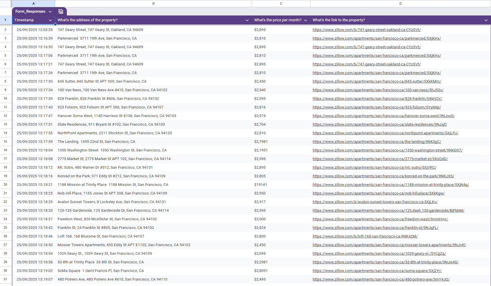

# Zillow Scraping Project

**Project Type:** Web Scraping + Automation  
**Course:** Angela Yu’s 100 Days of Code - Day 53 Project  

---

## Project Overview

This project demonstrates a full workflow for scraping rental property data from a Zillow Clone website and automatically submitting it into a Google Form using Python. It combines **web scraping** with **browser automation**, showing how to collect, clean, and organize data efficiently.

---

## Screenshot

## Features

1. **Data Scraping**
   - Collects **prices, addresses, and links** of rental properties from the [Zillow Clone](https://appbrewery.github.io/Zillow-Clone/).
   - Cleans prices (removes `/mo`, `+` signs) and formats them with a dollar sign.
   - Cleans addresses to remove unnecessary characters and whitespace.

2. **Automated Google Form Submission**
   - Opens a Google Form using Selenium.
   - Loops through all scraped properties and fills in:
     - Address
     - Price
     - Link
   - Submits the form for each property automatically.
   - Clicks the "Submit another response" link to continue submitting all entries.

3. **Environment Variables**
   - URLs (Zillow clone and Google Form) are stored in a `.env` file for security.
   - Sensitive data is not exposed in the repository.

---

## Installation & Setup

1. Clone the repository.
2. Create a `.env` file in the root directory with the following content:
   ZILLOW_URL=https://appbrewery.github.io/Zillow-Clone/
   FORM_URL=YOUR_GOOGLE_FORM_LINK_HERE
3. Install dependencies
4. Run the script
5. Watch the automated browser fill in the Google Form for each property.

## Skills Demonstrated

- Web scraping using **BeautifulSoup** and **Requests**.
- Data cleaning and manipulation with Python (`re`, string methods).
- Browser automation using **Selenium**.
- Using **environment variables** to keep sensitive information secure.
- Handling dynamic web elements and looping through multiple entries.
